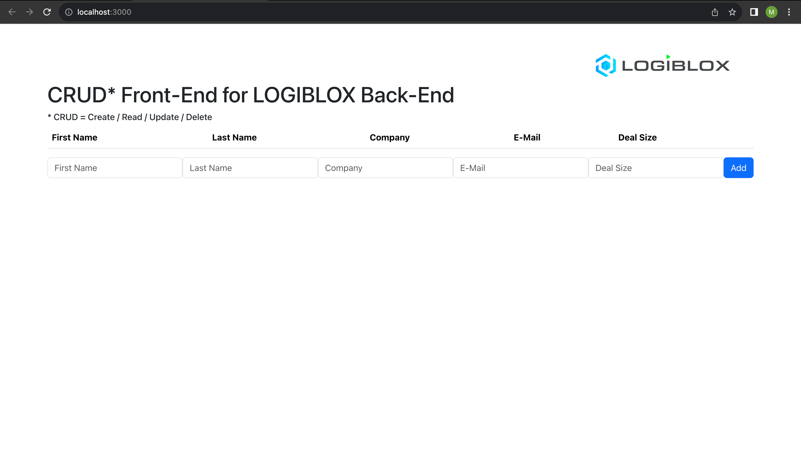
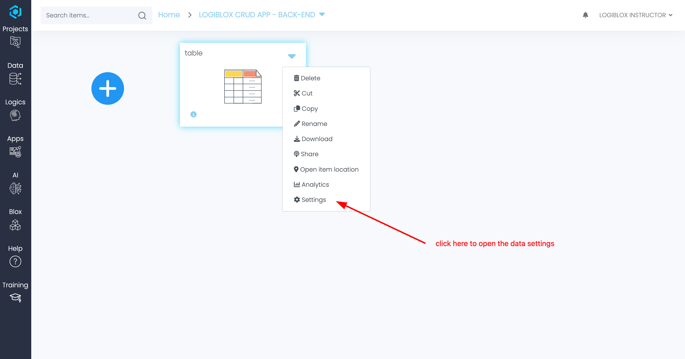
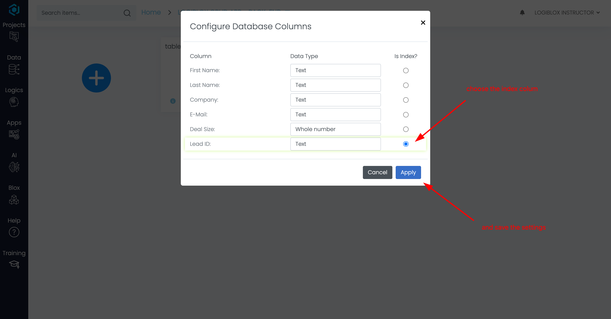
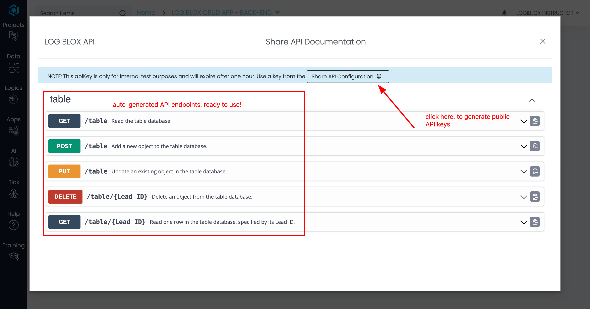
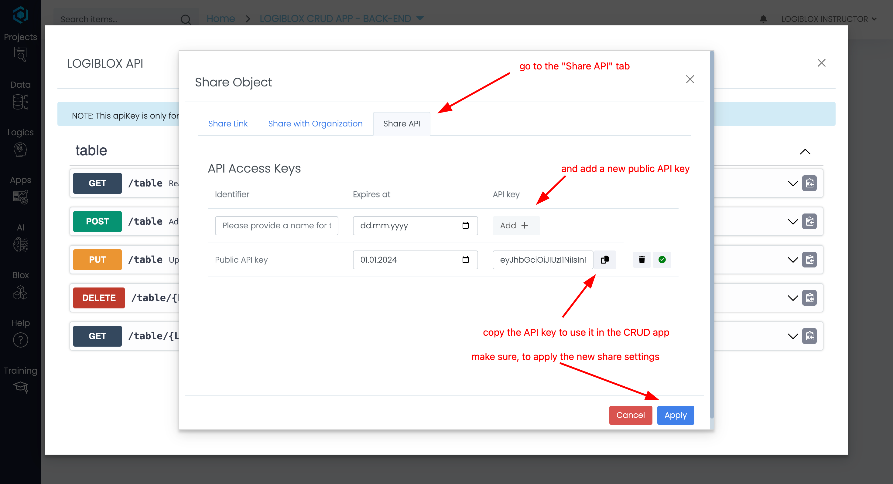
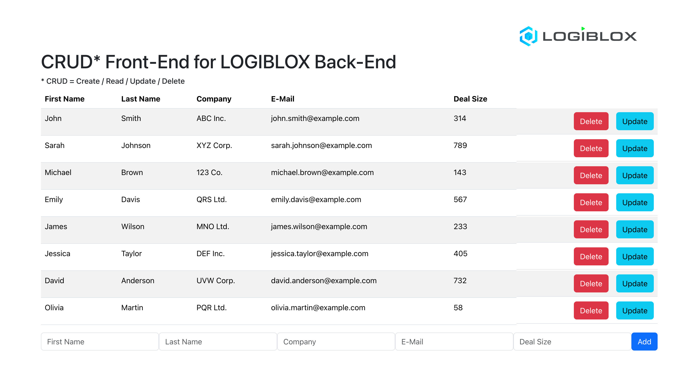

# LOGIBLOX CRUD Example App

This is a small example app, also called CRUD (Create, Read, Update, Delete) application, for interacting with the LOGIBLOX Back-End API. It allows you to manage data points using a simple interface.

## Getting Started

To get started with the LOGIBLOX CRUD example app, follow these steps to host the app locally on your machine.

   ```bash
   # clone the repo
   git clone git@github.com:filipLBX/logiblox-crud-app.git

   # navigate to the project directory 
   cd logiblox-crud-app

   # and open it in your favorite editor, i.e. VSCode
   code .
   ```

Next, set up the CRUD app by running:

   ```bash
   # install dependencies
   npm install

   # start the development server
   npm start
   ```

This should automatically open a web browser and navigate to [http://localhost:3000](http://localhost:3000) and look like this:



As you can see it is quite empty. Let's change that by

1. hosting a data base on logiblox.com
2. attaching the front-end to the automatically generated LOGIBLOX API endpoints.

## Setting up the LOGIBLOX Back-End API

### Create a database on LOGIBLOX

   To get started, the is a small datafile included in this repo in `data/table.csv`. Upload it to LOGIBLOX and specify the *Lead ID* column as index column. 

   
   

This column uniquely identifies each row and allows for row-specific operations such as update and delete in the database.

### Set up the API endpoints

   By clicking on the connector icon in the bottom right corner of the data object, you can access the automatically generated SWAGGER documentation. You can also test the API endpoints directly from there.

   Alternatively click on **Share API Configurations** to generate public API keys, which can be used to access the database and operate on it. Add a key there and copy it to the clipboard.  

   
   

### Add the API key/route to the front-end

- Create a `.env.local` file in the project root. This file will be ignored by Git and is only used to set environment variables for your local development environment. Since it contains a secret API key, it should never be committed to source control.
- Add the following environment variables to the `.env.local` file:
  - `REACT_APP_LOGIBLOX_API_URL` - copy this URL from the API documentation page
  - `REACT_APP_LOGIBLOX_API_KEY` - use the previously generated API key
- **RESTART THE APP** 
  - [in the terminal] CTRL+C and `npm start` again

#### Example `.env.local` content:

   ```plaintext
   REACT_APP_LOGIBLOX_API_URL=https://your-logiblox-url.com/api/v0/datapoints/table
   
   REACT_APP_LOGIBLOX_API_KEY=your-api-key
   ```

The browser should open again on [http://localhost:3000](http://localhost:3000) and look like this:




## Usage

In this small app, you can manage your data points in the LOGIBLOX database.
Create, read, update, and delete data points.

> Click the "Add" button to create a new data point.
>
> Click the "Update" button to modify a data point.
>
> Click the "Delete" button to remove a data point.
>

https://github.com/filipLBX/logiblox-crud-app/assets/58737201/27c72f12-c6e7-49d7-9515-0b4747d1cf77


## Learn More

For more information about LOGIBLOX, visit [LOGIBLOX](https://logiblox.com).

Happy managing your data points with LOGIBLOX CRUD API!
